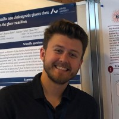
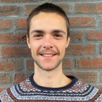



## Current Team

| **Pedram Bakhtiarifard** | (2022/10--)| Research Assistant working on methods for sustainable AI and Resource Efficient ML.|[Bakhtiarifard et al. 2024](https://arxiv.org/abs/2210.06015);   [Bakhtiarifard et al. 2025](https://arxiv.org/abs/2502.20016);   |
|**Frederik L. Johansen** | (2022/08--) | PhD fellow working on atomic structure prediction from X-ray Total Scattering and Pair Distribution Function data using Generative ML.|[Friis-Jensen,Johansen et al. (2024)](https://arxiv.org/abs/2402.13221);   [Johansen et al. (2024)](https://joss.theoj.org/papers/10.21105/joss.06024);   [Johansen et al. (2025)](https://arxiv.org/abs/2502.02189);  |
| **Ulrik Friis-Jensen** | (2022/08--) | PhD fellow working on using GNNs and Generative Models to do structure solution of nanoparticles from Total Scattering and Pair Distribution Function (PDF) data.| [Friis-Jensen,Johansen et al. (2024)](https://arxiv.org/abs/2402.13221);   [Johansen et al. (2024)](https://joss.theoj.org/papers/10.21105/joss.06024);   [Johansen et al. (2025)](https://arxiv.org/abs/2502.02189);  |
| **Tong Chen** | (2023/06--) | *Postdoc working on sustainable Machine Learning*| [Chen & Selvan (2025)](https://arxiv.org/abs/2402.05675);  [Thorsteinsson et al. (2024)](https://arxiv.org/abs/2403.09441); |
| **Jákup O. Svöðstein** | (2023/06--)| Double PhD candidate (jointly with University of Faroe Islands) studying Data-Driven Machine Learning Approaches for Compressible and Incompressible Fluid Dynamics Modelling.| |
| **Bob Pepin** | (2024/01--) | *Postdoc working on sustainable machine learning*|[Pepin et al. (2024)](https://arxiv.org/abs/2412.09254);  [Selvan et al. (2024)](https://arxiv.org/abs/2403.12562);  [Wenshøj et al. (2025)](https://arxiv.org/abs/2502.00490); |
| **Rasmus Løvstad** | (2024/03--) | *Student Research Assistant working on carbon footprint aware task scheduling.*| |
| **Jonathan V. Wenshøj** | (2024/08--) | *Student Research Assistant working on quantization of neural networks.*| [Wenshøj et al. (2025)](https://arxiv.org/abs/2502.00490);|

## Former Team Members

| **Sebastian Eliassen** | (2023/10--2024/10) | *Research Assistant with a focus on Low-precision Deep Learning*| [Eliassen & Selvan (2024)](https://arxiv.org/abs/2309.11856)|
| **Dustin Wright** | (2023/02--2024/01) | *Postdoc with a focus on sustainable Machine Learning*|[Wright et al. (2023)](https://arxiv.org/abs/2309.02065);  [Wright et al. (2024)](https://arxiv.org/abs/2406.01345);|
| **Julian E. Schön** | (2023/01--2023/12)| Research Assistant with a focus on dataset condensation methods. Julian also worked on his MSc thesis co-supervised by RS on interpreting the latent spaces of generative models.| [Schön et al. 2023](https://arxiv.org/abs/2301.05465);  [Schön et al. 2022](https://arxiv.org/abs/2207.09740)|

